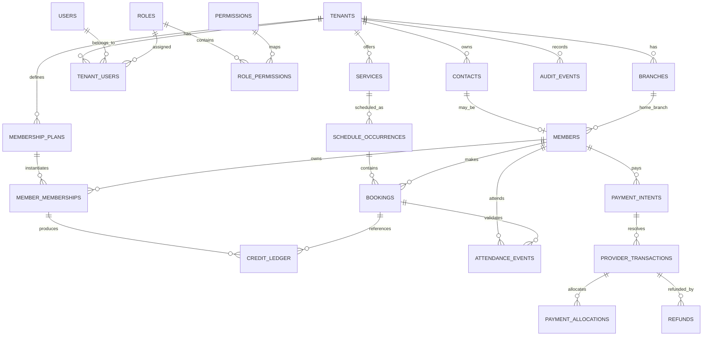

# FITOS Database Schema and ERD

## Database conventions

PostgreSQL.

- IDs: UUID
- naming: `snake_case`
- timestamps: `timestamptz`
- local recurring schedule time: `time`
- local recurring date: `date`
- money: `bigint amount_minor` + ISO currency
- tenant-owned tables: mandatory `tenant_id`
- production schema changes: migrations only

## Sprint 01 tables

### `tenants`

```sql
CREATE TABLE tenants (
  id uuid PRIMARY KEY,
  name varchar(160) NOT NULL,
  slug varchar(100) NOT NULL UNIQUE,
  default_timezone varchar(80) NOT NULL DEFAULT 'Africa/Nairobi',
  default_currency varchar(3) NOT NULL DEFAULT 'KES',
  status varchar(30) NOT NULL DEFAULT 'active',
  created_at timestamptz NOT NULL DEFAULT now(),
  updated_at timestamptz NOT NULL DEFAULT now()
);
```

### `branches`

```sql
CREATE TABLE branches (
  id uuid PRIMARY KEY,
  tenant_id uuid NOT NULL REFERENCES tenants(id),
  name varchar(160) NOT NULL,
  slug varchar(100) NOT NULL,
  timezone varchar(80),
  phone varchar(40),
  email varchar(255),
  address_line_1 varchar(255),
  address_line_2 varchar(255),
  city varchar(120),
  country_code varchar(2) NOT NULL DEFAULT 'KE',
  latitude numeric(9,6),
  longitude numeric(9,6),
  is_active boolean NOT NULL DEFAULT true,
  created_at timestamptz NOT NULL DEFAULT now(),
  updated_at timestamptz NOT NULL DEFAULT now(),
  UNIQUE (tenant_id, slug)
);
```

### `users`

```sql
CREATE TABLE users (
  id uuid PRIMARY KEY,
  email varchar(255),
  phone_e164 varchar(30),
  password_hash text NOT NULL,
  display_name varchar(160) NOT NULL,
  status varchar(30) NOT NULL DEFAULT 'active',
  last_login_at timestamptz,
  created_at timestamptz NOT NULL DEFAULT now(),
  updated_at timestamptz NOT NULL DEFAULT now()
);
```

### `roles`

```sql
CREATE TABLE roles (
  id uuid PRIMARY KEY,
  tenant_id uuid REFERENCES tenants(id),
  name varchar(80) NOT NULL,
  system_key varchar(80),
  is_system boolean NOT NULL DEFAULT false
);
```

### `permissions`

```sql
CREATE TABLE permissions (
  key varchar(100) PRIMARY KEY,
  description varchar(255) NOT NULL
);
```

### `role_permissions`

```sql
CREATE TABLE role_permissions (
  role_id uuid NOT NULL REFERENCES roles(id),
  permission_key varchar(100) NOT NULL REFERENCES permissions(key),
  PRIMARY KEY (role_id, permission_key)
);
```

### `tenant_users`

```sql
CREATE TABLE tenant_users (
  id uuid PRIMARY KEY,
  tenant_id uuid NOT NULL REFERENCES tenants(id),
  user_id uuid NOT NULL REFERENCES users(id),
  role_id uuid NOT NULL REFERENCES roles(id),
  status varchar(30) NOT NULL DEFAULT 'active',
  created_at timestamptz NOT NULL DEFAULT now(),
  UNIQUE (tenant_id, user_id)
);
```

### `user_branch_access`

```sql
CREATE TABLE user_branch_access (
  tenant_user_id uuid NOT NULL REFERENCES tenant_users(id),
  branch_id uuid NOT NULL REFERENCES branches(id),
  PRIMARY KEY (tenant_user_id, branch_id)
);
```

### `sessions`

```sql
CREATE TABLE sessions (
  id uuid PRIMARY KEY,
  user_id uuid NOT NULL REFERENCES users(id),
  session_token_hash text NOT NULL UNIQUE,
  expires_at timestamptz NOT NULL,
  last_seen_at timestamptz,
  ip_hash varchar(128),
  user_agent_summary varchar(255),
  revoked_at timestamptz,
  created_at timestamptz NOT NULL DEFAULT now()
);
```

If Redis is the primary session store, the database session table may be omitted. Pick one source of truth.

### `contacts`

```sql
CREATE TABLE contacts (
  id uuid PRIMARY KEY,
  tenant_id uuid NOT NULL REFERENCES tenants(id),
  first_name varchar(120) NOT NULL,
  last_name varchar(120),
  phone_raw varchar(60),
  phone_e164 varchar(30),
  email varchar(255),
  date_of_birth date,
  preferred_branch_id uuid REFERENCES branches(id),
  source varchar(80),
  created_at timestamptz NOT NULL DEFAULT now(),
  updated_at timestamptz NOT NULL DEFAULT now()
);

CREATE INDEX idx_contacts_tenant_phone
ON contacts(tenant_id, phone_e164);

CREATE INDEX idx_contacts_tenant_name
ON contacts(tenant_id, first_name, last_name);
```

### `members`

```sql
CREATE TABLE members (
  id uuid PRIMARY KEY,
  tenant_id uuid NOT NULL REFERENCES tenants(id),
  contact_id uuid NOT NULL REFERENCES contacts(id),
  home_branch_id uuid REFERENCES branches(id),
  member_number varchar(60),
  status varchar(30) NOT NULL DEFAULT 'active',
  joined_at timestamptz,
  created_at timestamptz NOT NULL DEFAULT now(),
  updated_at timestamptz NOT NULL DEFAULT now(),
  UNIQUE (tenant_id, member_number)
);
```

### `audit_events`

```sql
CREATE TABLE audit_events (
  id uuid PRIMARY KEY,
  tenant_id uuid NOT NULL REFERENCES tenants(id),
  branch_id uuid REFERENCES branches(id),
  actor_user_id uuid REFERENCES users(id),
  action varchar(120) NOT NULL,
  resource_type varchar(80) NOT NULL,
  resource_id uuid,
  before_summary jsonb,
  after_summary jsonb,
  request_id varchar(120),
  created_at timestamptz NOT NULL DEFAULT now()
);

CREATE INDEX idx_audit_tenant_created
ON audit_events(tenant_id, created_at DESC);
```

---

# Future core tables

## CRM

```text
leads
lead_events
lead_tasks
notes
tags
contact_tags
```

`contacts` remain the person identity layer; a lead and member reference the contact rather than duplicating identity.

## Staff

```text
staff
staff_branch_assignments
trainer_specialties
```

## Services

```text
services
service_categories
rooms
resources
```

## Scheduling

```text
schedule_templates
schedule_occurrences
schedule_exceptions
trainer_availability
```

A recurring template represents intent. Occurrences represent actual bookable instances.

## Booking

```text
bookings
booking_status_events
waitlist_entries
```

`bookings` must be transactionally capacity-safe.

## Membership

```text
membership_plans
plan_entitlements
member_memberships
credit_ledger
```

Credits use append-only ledger movements:
```text
+10 purchase
-1 booking
+1 eligible cancellation
-1 manual adjustment
```

## Attendance

```text
attendance_events
```

## Payments

```text
payment_intents
provider_transactions
payment_allocations
refunds
payment_webhook_events
```

Separate provider transaction truth from internal allocation.

---

# Core future SQL shapes

## `services`

```sql
CREATE TABLE services (
  id uuid PRIMARY KEY,
  tenant_id uuid NOT NULL REFERENCES tenants(id),
  branch_id uuid REFERENCES branches(id),
  name varchar(160) NOT NULL,
  slug varchar(120) NOT NULL,
  service_type varchar(30) NOT NULL,
  duration_minutes int NOT NULL,
  default_capacity int,
  amount_minor bigint,
  currency varchar(3),
  public_visible boolean NOT NULL DEFAULT false,
  is_active boolean NOT NULL DEFAULT true,
  created_at timestamptz NOT NULL DEFAULT now(),
  UNIQUE (tenant_id, branch_id, slug)
);
```

## `schedule_occurrences`

```sql
CREATE TABLE schedule_occurrences (
  id uuid PRIMARY KEY,
  tenant_id uuid NOT NULL REFERENCES tenants(id),
  branch_id uuid NOT NULL REFERENCES branches(id),
  template_id uuid,
  service_id uuid NOT NULL REFERENCES services(id),
  trainer_staff_id uuid,
  room_id uuid,
  starts_at timestamptz NOT NULL,
  ends_at timestamptz NOT NULL,
  capacity int NOT NULL,
  status varchar(30) NOT NULL DEFAULT 'scheduled',
  created_at timestamptz NOT NULL DEFAULT now()
);
```

## `bookings`

```sql
CREATE TABLE bookings (
  id uuid PRIMARY KEY,
  tenant_id uuid NOT NULL REFERENCES tenants(id),
  branch_id uuid NOT NULL REFERENCES branches(id),
  occurrence_id uuid NOT NULL REFERENCES schedule_occurrences(id),
  member_id uuid REFERENCES members(id),
  contact_id uuid REFERENCES contacts(id),
  status varchar(30) NOT NULL DEFAULT 'confirmed',
  source varchar(30) NOT NULL DEFAULT 'staff',
  booked_at timestamptz NOT NULL DEFAULT now(),
  cancelled_at timestamptz,
  cancellation_reason varchar(255),
  created_by_tenant_user_id uuid REFERENCES tenant_users(id),
  created_at timestamptz NOT NULL DEFAULT now()
);

CREATE INDEX idx_bookings_occurrence_status
ON bookings(tenant_id, occurrence_id, status);
```

## `payment_intents`

```sql
CREATE TABLE payment_intents (
  id uuid PRIMARY KEY,
  tenant_id uuid NOT NULL REFERENCES tenants(id),
  branch_id uuid REFERENCES branches(id),
  contact_id uuid REFERENCES contacts(id),
  member_id uuid REFERENCES members(id),
  amount_minor bigint NOT NULL,
  currency varchar(3) NOT NULL,
  payment_method varchar(30) NOT NULL,
  status varchar(30) NOT NULL DEFAULT 'initiated',
  idempotency_key varchar(120),
  purpose varchar(60),
  created_at timestamptz NOT NULL DEFAULT now(),
  UNIQUE (tenant_id, idempotency_key)
);
```

## `provider_transactions`

```sql
CREATE TABLE provider_transactions (
  id uuid PRIMARY KEY,
  tenant_id uuid NOT NULL REFERENCES tenants(id),
  payment_intent_id uuid REFERENCES payment_intents(id),
  provider varchar(40) NOT NULL,
  provider_transaction_id varchar(160),
  provider_reference varchar(160),
  amount_minor bigint NOT NULL,
  currency varchar(3) NOT NULL,
  status varchar(30) NOT NULL,
  occurred_at timestamptz,
  created_at timestamptz NOT NULL DEFAULT now()
);
```

---

# Mermaid ERD



## Tenant isolation rule

Every repository operation for tenant-owned data must either:
1. receive a tenant-scoped query context, or
2. run inside a tenant-scoped unit of work.

This API is forbidden:

```ts
findMemberById(memberId)
```

Preferred:

```ts
findMemberById({ tenantId, branchIds }, memberId)
```

## Sprint 01 schema rule

Only migrate Sprint 01 tables initially. Future schema in this document is a contract for later phases, not permission to pre-build unused database complexity.
